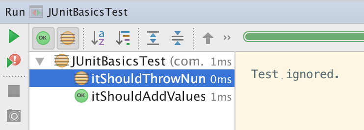

!SLIDE
# Ignoring a Test

!SLIDE
	@@@ Java
	// NOTE: We don't need it now because...
	// @Test
	// public void someTest() {
	//   // ...
	// }

!SLIDE
## Why commenting out
## is a bad idea?

!SLIDE
## You forget it soon...

!SLIDE
## Let test runner report it
	@@@ Java
	@Ignore
	@Test
	public void someTest() {
	  // ...
	}

!SLIDE

!SLIDE
## Be better with a message
	@@@ Java
	@Ignore("It seems to be a problematic test case.")
	@Test
	public void itShouldThrowNumberFormatExceptionWhenTheValuesAreInvalid() {
	  // ...
	}

