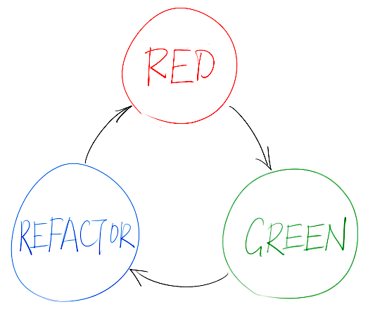

!SLIDE reversed
# One more thing...

!SLIDE
# *TDD*

!SLIDE
## Test Driven Development

!SLIDE
## The TDD Cycle

!SLIDE
# RED
## Write a *failed* test

!SLIDE
# GREEN
## Make it pass with the
## *easiest* code possible

!SLIDE
# REFACTOR
## Remove all *duplication*
## introduced to pass the test

!SLIDE
# Benefits

!SLIDE
## Less debug time

!SLIDE
## Code with confidence

!SLIDE
## Reliable documentation

!SLIDE
# Not Silver Bullet
