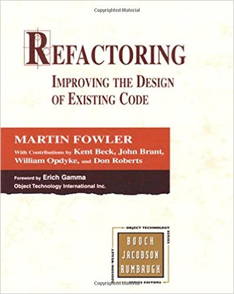

!SLIDE
# Recommend Readings

!SLIDE

### [Growing Object-Oriented Software, Guided by Tests](http://www.amazon.com/dp/0321503627/)

!SLIDE

### [Test Driven Development: By Example](http://www.amazon.com/dp/0321146530/)

!SLIDE

### [Working Effectively with Legacy Code](http://www.amazon.com/dp/0131177052/)

!SLIDE

### [Refactoring: Improving the Design of Existing Code](http://www.amazon.com/dp/0201485672/)
