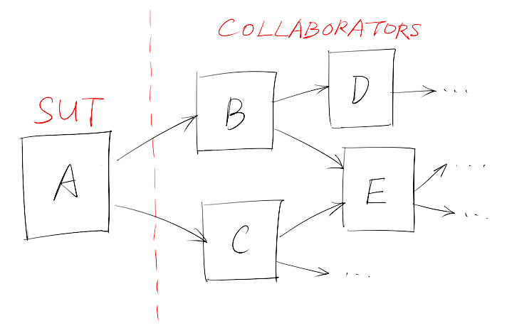
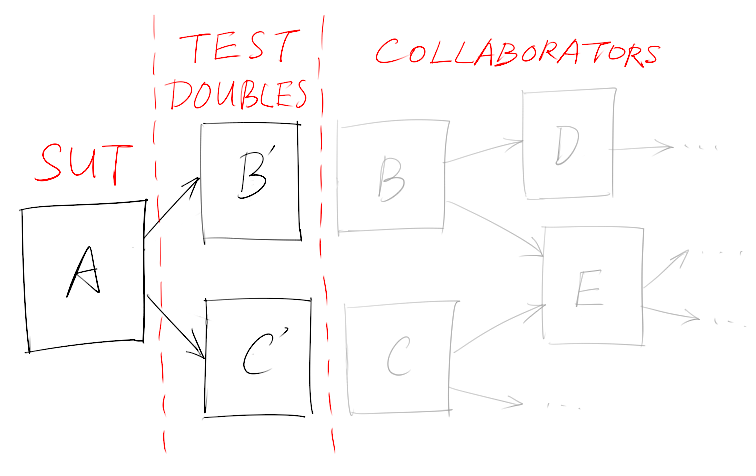

!SLIDE
## How to deal with
## network & database?

!SLIDE
	@@@ Java
	public class Example {
	  private DatabaseThingie myDatabase;

	  public Example() {
	    myDatabase = new DatabaseThingie();
	  }

	  public void doStuff() {
	    myDatabase.getData();
	    // ...
	  }
	}

!SLIDE
## SUT & Collaborators

!SLIDE
## Isolation

!SLIDE
# Dependency
# Injection

!SLIDE
## Dependency injection means
## *giving an object*
## *its instance variables*.
## Really. That's it.
### ([by James Shore](http://www.jamesshore.com/Blog/Dependency-Injection-Demystified.html))

!SLIDE
	@@@ Java
	public class Example {
	  private DatabaseThingie myDatabase;

	  // public Example() {}

	  public setDatabase(DatabaseThingie database) {
	    myDatabase = database;
	  }

	  public void doStuff() {
	    myDatabase.getData();
	    // ...
	  }
	}

!SLIDE
# Test Double

!SLIDE
## Pretend object used
## in place of a real object
## for testing purposes

!SLIDE
## Dummy/Fake/Stub/Mock/Spy

!SLIDE
	@@@ Java
	public interface MailService {
	  public void send(Message msg);
	}

	public class Order {
	  private MailService mailer;
	  public void confirm() {
	    // ...
	    mailer.send(new Message(...));
	  }
	  // ...
	}

!SLIDE
	@@@ Java
	@Test
	public void itShouldSendMailAfterConfirmed() {
	  Order order = new Order(...);
	  MailService mailer = ???
	  order.setMailer(mailer);
	  order.confirm();
	  // How to verify?
	}

!SLIDE
	@@@ Java
	public class MailServiceStub implements MailService {
	  private List<Message> messages = new ArrayList<>();
	  public void send(Message msg) {
	    messages.add(msg);
	  }
	  public int numberSent() {
	    return messages.size();
	  }
	}

!SLIDE
	@@@ Java
	@Test
	public void itShouldSendMailAfterConfirmed() {
	  Order order = new Order(...);
	  MailServiceStub mailer = new MailServiceStub();
	  order.setMailer(mailer);
	  order.confirm();
	  assertEquals(1, mailer.numberSent());
	}

!SLIDE
	@@@ Java
	@Test
	public void itShouldDoXxxWhenSendingMailFailed() {
	  Order order = new Order(...);
	  MailServiceStub mailer = new MailServiceStub();
	  order.setMailer(mailer);
	  order.confirm(); // How to simulate failure
	  // Verify do xxx
	}

!SLIDE
	@@@ Java
	public class MailServiceStub implements MailService {
	  public void send(Message msg) {
	    throw new MailDeliveryException(...);
	  }
	}

!SLIDE
# Too many code
# to setup
# test doubles
